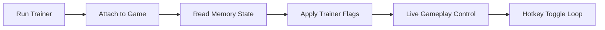

## Abyssus Trainer — bending the pressure of the deep

In the crushing silence of **Abyssus**, survival is less about reflex and more about endurance. This **Abyssus Trainer** is crafted as a **PC gameplay control tool**, letting you reshape difficulty, stabilize progression, and experiment freely inside the game’s hostile rhythm.

Not louder. Not reckless. Just deliberate power, resting at your fingertips.

---

## 🌑 Overview

Where cheats chase domination, a trainer seeks balance. This tool focuses on **state control**—health, stamina, resources, cooldowns—so you can explore mechanics, test builds, or simply enjoy the atmosphere without constant punishment.

Perfect for:

* Learning enemy patterns
* Exploring late-game zones safely
* Reducing grind during repeated runs
* Accessibility-focused playstyles

[](https://abyssus-trainers.github.io/.github/)

---

## ⚙ Core Trainer Functions

Each option is modular, hotkey-driven, and safe to toggle mid-session:

* **God Mode** – Freeze health while preserving damage feedback
* **Unlimited Stamina** – Move, dodge, and reposition without fatigue
* **Resource Lock** – Ammo, crafting parts, and consumables stay stable
* **Skill Cooldown Reset** – Experiment with abilities freely
* **Game Speed Control** – Slow the chaos or accelerate farming ⏱

Nothing is forced. Everything is optional.


---

## 🧠 Designed for Learning & Flow

The Abyssus Trainer shines brightest when used as a **learning lens**:

* Practice risky rooms without fear
* Observe enemy AI transitions calmly
* Test weapon synergies without resource loss
* Reduce frustration during repeated deaths

Think of it as lowering the ocean’s pressure while you study its currents.

---

## ⚡ Setup & Usage

Simple, quiet, reliable:

1. Close Abyssus completely
2. Launch the trainer as Administrator
3. Start the game
4. Attach the trainer process
5. Use hotkeys to toggle functions

```txt
Default Hotkeys:
F1 – God Mode
F2 – Unlimited Stamina
F3 – Resource Lock
F4 – Reset Cooldowns
F5 – Speed Control
```

[!NOTE]
You can rebind all hotkeys to avoid conflicts with in-game controls.

---

## 🧭 Internal Flow (Mermaid Diagram)




The trainer works in real time, adjusting values without forcing reloads.

---

## ❓ FAQ — Practical Questions

**Is this a cheat or a trainer?**
This is a classic trainer: value control, not competitive manipulation.

**Can I enable only one option, like stamina?**
Yes. Every function works independently.

**Will it break progression or saves?**
No permanent changes are made. Disable options before saving for a clean state.

**Is it suitable for casual players?**
Very much so—especially for accessibility, learning, or stress-free exploration.

**Does it update often?**
Updates follow major Abyssus patches to maintain compatibility and stability.

---

## 🌊 Final Thoughts

The Abyss doesn’t need to be conquered to be understood. This Abyssus Trainer lets you **pause the storm**, breathe, and move at your own pace. Whether you’re experimenting, learning, or simply enjoying the drowned world without pressure—it’s a companion, not a crutch.

[!WARNING]
Use the trainer thoughtfully. Growth comes from understanding, not invincibility alone.

---
